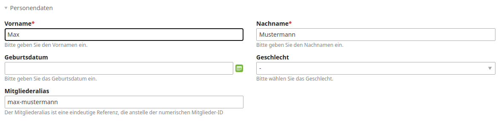

# Contao Advanced Member Bundle

This bundle enhances the contao member entity with additional fields and functions. 
All features are optional and must be activated or explicitly used, so just pick
the functionality you need.

## Features

- option to add a member alias
- option to add additional member fields
- Lock member login command

## Usage

### Install  

1. Install with composer or contao manager

        composer require heimrichhannot/contao-advanced-member-bundle

2. Update database

### Member alias



Set `huh_advanced_member.enable_member_alias` to `true` and update the database, to enable member aliase. 

```yaml
# config/config.yml
huh_advanced_member:
    enable_member_alias:  true
```

### Additional fields

This bundle can add some often needed additional fields to the member entity. 

There are 4 categories of fields that you can activate in your configuration:

```yaml
huh_advanced_member:
  enable_additional_title_fields: true
  enable_additional_job_fields: true
  enable_image_fields: true
  enable_social_fields: true
```

**Title fields:**
* academicTitle
* extendedTitle
* nobilityTitle
* academicDegree

**Job fields:**
* jobTitles
* position

**Image fields**
* addImage
* singleSRC (in addImage subpalette)
* caption (in addImage subpalette)

**Social fields**
* linkedinProfile
* xingProfile
* facebookProfile
* twitterProfile


### Lock member logins

To lock or unlock the login for all members, use the `huh:member:lock-login` command.

```
Usage:
  huh:member:lock-login [options] [--] <action>

Arguments:
  action                Choose which action to perform: One of "lock"; "unlock"

Options:
      --dry-run         Performs a run without making changes to the database.
  -h, --help            Display this help message
  -q, --quiet           Do not output any message
  -v|vv|vvv, --verbose  Increase the verbosity of messages: 1 for normal output, 2 for more verbose output and 3 for debug

Help:
  This command disables (or restore) the login option for all members.
  
  The following statement disables the login for all members:
  
  php ./vendor/bin/contao-console huh:member:lock-login lock
  
  The following statement restores the login for all members where the login was disabled by this command:
  
  php ./vendor/bin/contao-console huh:member:lock-login unlock
  
  If you want to check how many members will be locked before, you can use the dry-run option:
  
  php ./vendor/bin/contao-console huh:member:lock-login lock --dry-run
```

## Configuration reference

```yaml
# Default configuration for extension with alias: "huh_advanced_member"
huh_advanced_member:

   # Enable to add an alias field to member entity.
   enable_member_alias:  false

   # Enable to add additional title fields to member entity.
   enable_additional_title_fields: false

   # Enable to add additional job fields to member entity.
   enable_additional_job_fields: false

   # Enable to add image fields to member entity.
   enable_image_fields:  false

   # Enable to add social fields to member entity.
   enable_social_fields: false
```